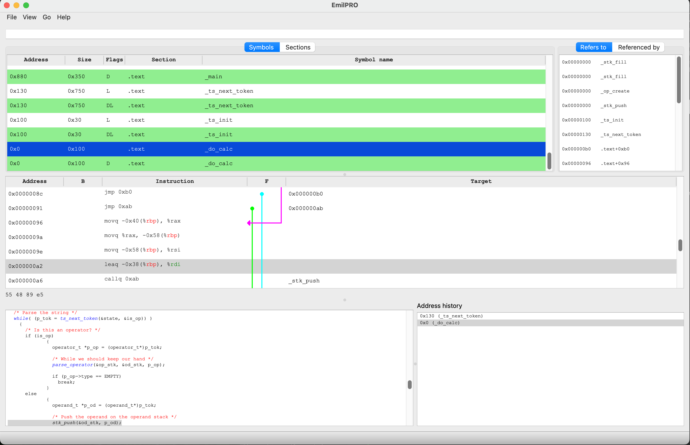

# EmilPRO
A graphical disassembler for multiple architectures. Meant mainly as a debugging tool.



Features:

* Easy filtering of symbol names/addresses
* Cross-references for both symbols and instructions
* Navigation via jumps and calls
* History of visited addresses/symbols, with back/forward navigation
* High-level source code display (if available)
* Highlight used registers

## Preparations for build

### Debian/Ubuntu

```
sudo apt install g++ cmake ninja-build python3-pip binutils-multiarch-dev qt6-base-dev libglx-dev libgl1-mesa-dev
pip3 install conan
```

### Fedora

Still TODO, but more or less like Ubuntu.

### MacOS

```
brew install binutils qt6 conan cmake ninja
```

## Build
The instructions below are for release builds. For debug builds, replace `Release` with `Debug`, and then
also unit tests will be built.

### Conan setup

```
conan install -of build --build=missing -s build_type=Release conanfile.txt
```

### Linux
```
cmake -B build -GNinja -DCMAKE_PREFIX_PATH="`pwd`/build/build/Release/generators/" -DCMAKE_BUILD_TYPE=Release
ninja -C build
```

### MacOS

Remove binutils from the PATH (for the conan build)

```
conan install -of build --build=missing -s build_type=Release conanfile.txt
```

```
cmake -B build -GNinja -DCMAKE_PREFIX_PATH="`pwd`build/build/Release/generators/;`brew --prefix binutils`" -DCMAKE_BUILD_TYPE=Release
ninja -C build
```

## More information
Simon Kagstrom <simon.kagstrom@gmail.com>
